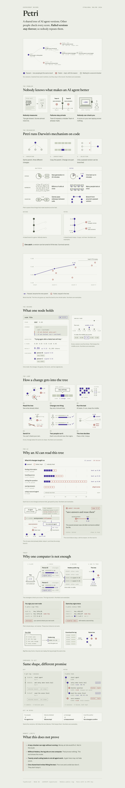

# Petri

Petri is a version tree for AI agent harnesses. A harness is the code around a model:
the prompt, the retry loop, the context it reads. Petri records every change to it.

Each version in the tree holds three things:

1. A hypothesis in plain English, with the result that would prove it wrong.
2. A benchmark score, measured as the median of 5 runs.
3. Signatures from other keys that re-ran the measurement.

A version is accepted only when 2 other keys re-run it and agree. Rejected versions are
never deleted, so the next agent reads them and does not try the same idea again.




*How Petri works, on one page. The numbers in this explainer are examples. The real recorded tree and its scores are further down, and live at [ethonline2026-two.vercel.app](https://ethonline2026-two.vercel.app/tree/coding--petri-harness-v1--claude-sonnet-5).*

---

## The problem

1. **Nobody measures.** Teams change a prompt, then say the agent "feels better". There is
   no baseline and no repeat count.
2. **Failures stay private.** A dead end stays in one person's terminal. The next engineer
   tries the same idea again and pays for the same tokens.
3. **Nobody can check a claim.** A reported gain cannot be re-run, because the harness and
   the measurement are not published.

## How Petri answers it

| Problem | What Petri does |
|---|---|
| Nobody measures | Every version runs 20 coding tasks 5 times. The median counts. |
| Failures stay private | Rejected versions stay in the tree with their reason. `petri digest` gives them to the next agent. |
| Nobody can check a claim | A version id is the SHA-256 of its manifest. Other keys re-run both the parent and the version, then sign the result. |

The evolution model:

- **Variation:** a version changes at most 2 files and 120 lines of its parent.
- **Inheritance:** a version starts from its parent's harness files.
- **Selection:** the acceptance rule in `petri/src/policy/acceptance.ts` sets the status.

---

## The acceptance rule

1. A verifier re-runs the parent and the version. Each side runs 5 times.
2. The author's key cannot verify its own version. Two reports from one key count as one.
3. The version is **accepted** when 2 distinct keys each measure at least +1000 basis points.
   (100 basis points = 1%.)
4. At or below -1000 basis points, it is **rejected** as a regression.
5. Between those limits, it is **rejected** as within noise.
6. A version that a guard or the typecheck stopped is never scored. It stays **pending**.

---

## Run it

You need Node and pnpm. No API key and no Hedera account are needed.

### The web app

```bash
npm install
npm run dev          # http://localhost:3000
```

1. Open http://localhost:3000.
2. Pick a domain, a model and a harness. The default is Research · Claude Sonnet 5 · Hermes Agent.
3. Open **Coding · Claude Sonnet 5 · Petri harness v1** to see the real tree.
4. Use the **Tree | Stats** switch to change the view.

The Petri harness tree comes from the engine in `petri/`. The page runs `petri export`
and `petri digest` on every request. The other trees are showcase trees. They show how
other domains could look. Nobody measured them.

### The engine

```bash
cd petri
pnpm install
pnpm typecheck       # no output means it passed
pnpm test            # 102 tests
pnpm petri tree      # the whole tree, rejected branches included
pnpm petri digest    # what the next agent reads before it proposes a change
pnpm petri dead-ends # every rejected version with its reason
```

---

## The recorded tree

`petri/.petri/` holds 16 versions: 3 accepted, 2 rejected and 11 pending.

| Version | Status | What it tried |
|---|---|---|
| `0a54718a` | pending (the start) | Single-shot prompt, no retry. 5 of 20 tasks. |
| `ecc7cdb0` | accepted, +7000bp | Full symbol signatures and one worked example. 19 of 20 tasks. |
| `872aaa3d` | rejected, -7000bp | Removing the signatures and the example again |
| `ea3b7532` | accepted, +7000bp | Restoring them, one step after the rejected version |
| `f07e0c55` | rejected, -7000bp | Trimming the prompt again to save tokens |
| `92dc9c49` | accepted, +7000bp | Restoring the signatures after the trim |
| `ec1d39e6` | pending, 1 of 2 keys | An independent re-test of signatures and example, +7000bp so far |
| `e1adae18` | pending, 1 of 2 keys | A short prompt without the reply-shape block, -7000bp so far |
| `2e7f6b5b` | pending, not scored | Stating every prompt rule as a positive directive |
| 7 more | pending, not scored | Changes stopped by a guard or by the typecheck |

All scores are from **replay mode**. Replay runs recorded model answers through the real
sandbox, and the tests really run. It does not call a model.

---

## Demo: a second key accepts a version

`ec1d39e6` has 1 verification. One more verification from a different key accepts it.

1. Open http://localhost:3000/tree/coding--petri-harness-v1--claude-sonnet-5.
2. Find "An independent re-test confirms…". It shows `1 of 2 keys`.
3. Run the second verification:

   ```bash
   cd petri
   PETRI_HOME=~/petri-demo-keys/k3 pnpm petri verify ec1d39e6
   ```

4. Refresh the page. The version is now accepted and shows purple.

`~/petri-demo-keys/` exists on the machine that built this tree only. On another machine,
create a new key first. Any key that is not the author's key works:

```bash
PETRI_HOME=~/my-verifier pnpm petri id create --label verifier
PETRI_HOME=~/my-verifier pnpm petri verify ec1d39e6
```

To reset the tree after a demo:

```bash
git checkout -- petri/.petri
git clean -fd petri/.petri
```

---

## Hedera and World ID

### Every record on a public Hedera topic

The local log `petri/.petri/log.jsonl` holds every record: each version, each
verification and each status. `petri anchor` copies each line to a Hedera Consensus
Service (HCS) topic, as the exact bytes on disk and in order.

1. Get a testnet account from the Hedera portal.
2. Set the account and its key:

   ```bash
   export HEDERA_OPERATOR_ID=0.0.12345
   export HEDERA_OPERATOR_KEY=302e...
   ```

3. Create the topic. It has no admin key and no submit key, so nobody can delete it:

   ```bash
   cd petri
   pnpm petri anchor create --network testnet
   ```

4. Send the records that already exist:

   ```bash
   pnpm petri anchor push
   pnpm petri anchor status   # the topic, the count, and the HashScan link
   ```

After this, `verify`, `submit`, `evolve` and `publish` send their new records to the
topic by themselves. Anyone can read the topic from the public mirror node and rebuild
the log. The hash chain in each line then shows that no line was changed or removed.
If a local line changes after it reached Hedera, `petri anchor status` reports it.

The anchor code has tests with a fake topic. It has not been run against a real topic
on this tree yet.

### World ID after each verification

After `petri verify` signs a report, it can check the verifier with World ID. The check
is **off** by default.

```bash
PETRI_WORLD_ID=1 PETRI_WORLD_ADDRESS=0xYourAgentWallet \
  PETRI_HOME=~/my-verifier pnpm petri verify <node>
```

1. The check looks up the wallet in World AgentBook on World Chain.
2. It records the anonymous human id, or the reason there is none, in
   `.petri/world-checks.jsonl`.
3. `petri anchor` sends that record to the same Hedera topic.

The lookup has run against World Chain. Two limits stay:

- The check does not yet prove that the wallet belongs to the key that signed the report.
- It does not change the acceptance rule. A report without a human id still counts.

---

## Add a new version

```bash
cd petri
MODE=replay ./demo/positive-prompt.sh
```

The script proposes a change under `ecc7cdb0` and submits it. In replay mode the change
passes the guards and the typecheck. It is recorded as `not-scored`, because replay holds
recorded answers for 2 harness versions only.

A live run can score a new harness. It needs `ANTHROPIC_API_KEY`:

```bash
ANTHROPIC_API_KEY=... ./demo/positive-prompt.sh
```

The live path has not been run on this tree yet.

---

## What the sandbox enforces

- The harness runs in a child process under Node `--permission`. It can read the prompt
  and the harness files only. It cannot read the tests.
- The generated solution runs in a second child process. The test source is never written to disk.
- A patch that changes more than 2 files or 120 lines, or changes `harness/contract.ts`, is refused.
- `petri verify` refuses a version that was never scored.

## What this does not prove

- **A verifier can sign without running the benchmark.** Nothing compares result hashes
  across verifiers yet.
- **Distinct keys are not distinct people.** One person can create many keys. The World ID
  check is off by default, and it does not yet link a wallet to a signing key.
- **A Hedera topic proves order and time, not honesty.** It shows when each record was
  written. It does not show that the benchmark really ran.
- **Replay covers 2 harness versions.** A new harness needs a live run to get a score.
- **The benchmark is 20 tasks.** A gain here may not carry over to other work.
- **Live mode is not deterministic.** The median of 5 runs reduces noise. It does not remove it.

---

## Repository layout

| Path | What it holds |
|---|---|
| `app/`, `components/`, `lib/*.ts` | The Petri web app (Next.js) |
| `lib/showcase.ts` | The showcase trees for other domains |
| `petri/` | The engine: CLI, benchmark, harness, recorded tree. See `petri/README.md`. |
| `petri/SPEC.md` | The contract for hashing, signing, the acceptance rule and the CLI |
| `petri/src/consensus/anchor.ts`, `petri/src/cli/anchor.ts` | The Hedera topic copy of every record |
| `petri/src/trust/world.ts` | The World ID check after `petri verify` |
| `petri/demo/verify-demo.sh` | The stage demo: verify, World ID (simulated), then Hedera |
| `lib/hedera/`, `lib/hederaone/` | Earlier Hedera client and World AgentKit helpers for the web side. The web app does not use them yet. |
